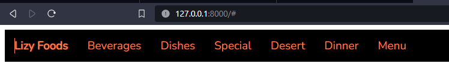

# e-Chakula
An app that allows user to see which food are offered at a restaurant by scanning a qr code. The admin side allows editing of food available

Steps when writing the code
1. Install virualenv using the command python -m pip install virtualenv
2. Create a virtual env using the command python -m virtual venv  // name of my virtual env is venv
3. Activate the virtual environment by using the command venv\scripts\activate
4. Install django using pip install django
5. Started a project lizzyFoods on the same directory using django-admin startproject lizzyFoods .
6. Start an app called food using the cmd python manage.py  startapp food
7. Create the apps urls.py file
8. Run migrations after updating the models using python manage.py makemigrations
9. Make migrations using python manage.py migrate
10. Create a simple pizza model and update using the shell
11. Create a superuser using manage.py createsuperuser
12. update the models for pizza, beverarg
THE NAVIGATION BAR

